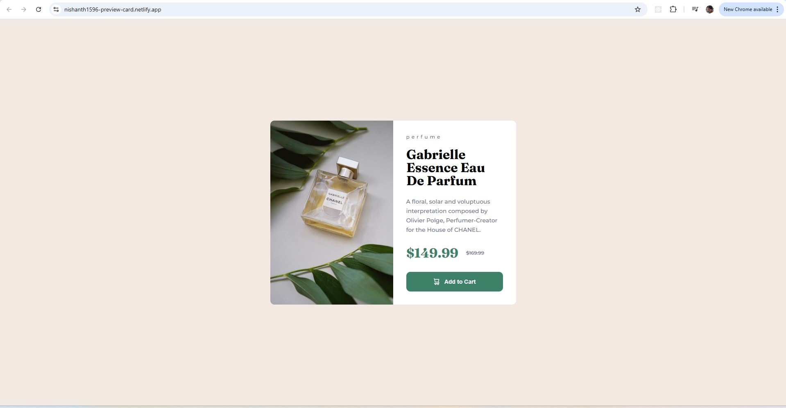

# Frontend Mentor - Product preview card component solution

This is a solution to the [Product preview card component challenge on Frontend Mentor](https://www.frontendmentor.io/challenges/product-preview-card-component-GO7UmttRfa). Frontend Mentor challenges help you improve your coding skills by building realistic projects.

## Table of contents

- [Overview](#overview)
  - [The challenge](#the-challenge)
  - [Screenshot](#screenshot)
  - [Links](#links)
- [My process](#my-process)
  - [Built with](#built-with)
  - [What I learned](#what-i-learned)
  - [Continued development](#continued-development)
  - [Useful resources](#useful-resources)
- [Author](#author)
- [Acknowledgments](#acknowledgments)

## Overview

### The challenge

Users should be able to:

- View the optimal layout depending on their device's screen size
- See hover and focus states for interactive elements

### Screenshot




### Links

- Solution URL: [GitHub Repository](https://github.com/nishanth1596/responsive-product-preview-card)
- Live Site URL: [Live site link](https://your-live-site-url.com)

## My process

### Built with

- Semantic HTML5 markup
- CSS custom properties
- Flexbox
- CSS Grid
- Desktop-first workflow

### What I learned

During this project, I learned how to effectively use **CSS Grid** and **Flexbox** to create responsive layouts. The challenge also helped me practice designing for different screen sizes using **media queries** and organizing my code for better readability.

For example, the layout of the card dynamically adjusts from a desktop to a mobile view:

```css
@media (max-width: 375px) {
  .container {
    grid-template-columns: 1fr;
  }

  .img {
    width: 343px;
    height: 240px;
    background-image: url("./images/image-product-mobile.jpg");
    background-size: cover;
  }
}


### Author

- Name: Nishanth
- Website - [My GitHub Profile](https://github.com/nishanth1596)
- Frontend Mentor - [@nishanth1596](https://www.frontendmentor.io/profile/nishanth1596)
- Twitter - [@nishanth1596](https://x.com/nishanth1596)

## Acknowledgments

Thanks to Frontend Mentor for providing this great challenge, which gave me the opportunity to practice creating a focused, desktop-first product-preview-card page layout. Also, thanks to the community for the feedback and inspiration!
```
